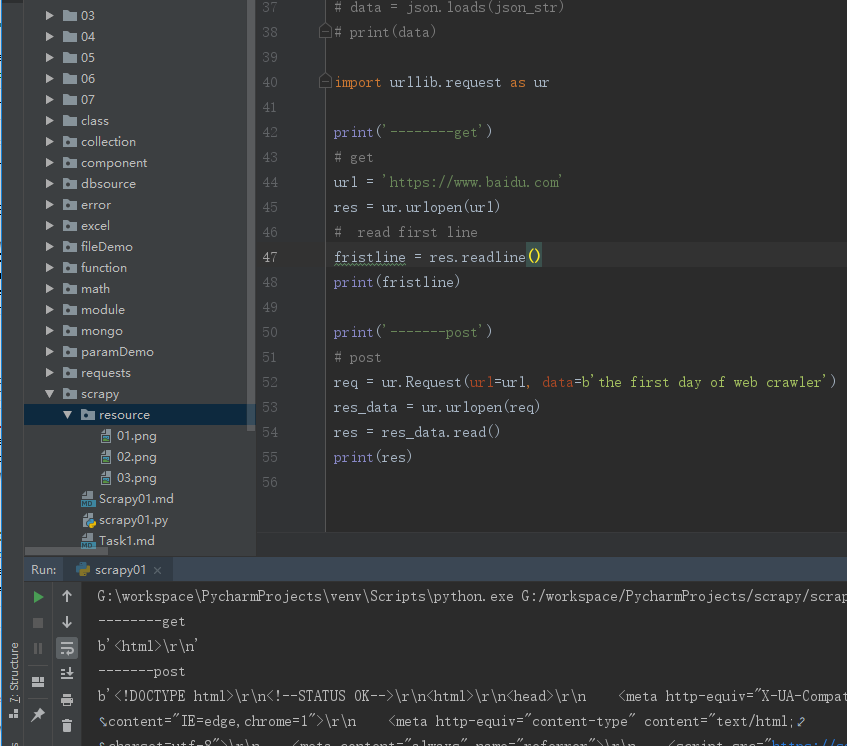
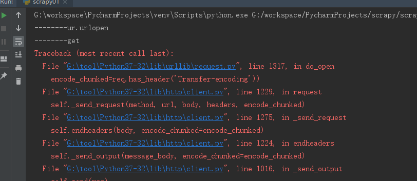

# python爬虫学习-day1


> 查考[python爬虫学习-day1](https://desmonday.github.io/2019/02/28/python%E7%88%AC%E8%99%AB%E5%AD%A6%E4%B9%A0-day1/)

>环境变量
```python
python 3.7 
pycharm 2018.3
```


## **1.1 学习get与post请求**

### 通过requests实现

>requests的get与post函数：
```python
get(url, params=None, **kwargs)
    Sends a GET request.
    
    :param url: URL for the new :class:`Request` object.
    :param params: (optional) Dictionary, list of tuples or bytes to send
        in the body of the :class:`Request`.
    :param \*\*kwargs: Optional arguments that ``request`` takes.
    :return: :class:`Response <Response>` object
    :rtype: requests.Response
    
 post(url, data=None, json=None, **kwargs)
    Sends a POST request.
    
    :param url: URL for the new :class:`Request` object.
    :param data: (optional) Dictionary, list of tuples, bytes, or file-like
        object to send in the body of the :class:`Request`.
    :param json: (optional) json data to send in the body of the :class:`Request`.
    :param \*\*kwargs: Optional arguments that ``request`` takes.
    :return: :class:`Response <Response>` object
    :rtype: requests.Response   
    
```
图

> 示例

```python

import requests
# get请求
url = 'https://www.baidu.com'
response = requests.get(url)
print(response.text)

print('--------------分割线--------------')
# post 请求
data = {
    "name": "aa",
    "school": 'linan'
}

response = requests.post(url, data=data)
print(response.text)
```

**结果**
get结果

post结果


> json的处理模块 json

### json
json模块提供了一种简单的方式来编码和解码JSON数据，其主要函数是json.dumps()和json.loads()

```python
import json

data = {
    "name": "aa",
    "school": 'linan'
}
#  将json对象转换成json字符串
json_str = json.dumps(data)
print(json_str)
# 将json字符串转换成json对象
data = json.loads(json_str)
print(data)
```

**结果**
```python
{"name": "aa", "school": "linan"}
{'name': 'aa', 'school': 'linan'}
```
解释：print输出json字符串，没问题，注意是的print(data)，与输出字符串结果一致，因为python解释器底层实现的(这块猜测，无法得知)


### 通过urllib实现

**函数**
```python
urlopen(url, data=None, timeout=<object object at 0x035B48B8>, *, cafile=None, capath=None, cadefault=False, context=None)
    Open the URL url, which can be either a string or a Request object.
    
    *data* must be an object specifying additional data to be sent to
    the server, or None if no such data is needed.  See Request for
    details.
    
    urllib.request module uses HTTP/1.1 and includes a "Connection:close"
    header in its HTTP requests.
    
    The optional *timeout* parameter specifies a timeout in seconds for
    blocking operations like the connection attempt (if not specified, the
    global default timeout setting will be used). This only works for HTTP,
    HTTPS and FTP connections.
    
    If *context* is specified, it must be a ssl.SSLContext instance describing
    the various SSL options. See HTTPSConnection for more details.
    
    The optional *cafile* and *capath* parameters specify a set of trusted CA
    certificates for HTTPS requests. cafile should point to a single file
    containing a bundle of CA certificates, whereas capath should point to a
    directory of hashed certificate files. More information can be found in
    ssl.SSLContext.load_verify_locations().
    
    The *cadefault* parameter is ignored.
    
    This function always returns an object which can work as a context
    manager and has methods such as
    
    * geturl() - return the URL of the resource retrieved, commonly used to
      determine if a redirect was followed
    
    * info() - return the meta-information of the page, such as headers, in the
      form of an email.message_from_string() instance (see Quick Reference to
      HTTP Headers)
    
    * getcode() - return the HTTP status code of the response.  Raises URLError
      on errors.
    
    For HTTP and HTTPS URLs, this function returns a http.client.HTTPResponse
    object slightly modified. In addition to the three new methods above, the
    msg attribute contains the same information as the reason attribute ---
    the reason phrase returned by the server --- instead of the response
    headers as it is specified in the documentation for HTTPResponse.
    
    For FTP, file, and data URLs and requests explicitly handled by legacy
    URLopener and FancyURLopener classes, this function returns a
    urllib.response.addinfourl object.
    
    Note that None may be returned if no handler handles the request (though
    the default installed global OpenerDirector uses UnknownHandler to ensure
    this never happens).
    
    In addition, if proxy settings are detected (for example, when a *_proxy
    environment variable like http_proxy is set), ProxyHandler is default
    installed and makes sure the requests are handled through the proxy.
```
urlopen可以进行get和post访问

**示例**
```python
import urllib.request as ur
print('--------get')
# get
url = 'https://www.baidu.com'
res = ur.urlopen(url)
#  read first line
fristline = res.readline()
print(fristline)

print('-------post')
# post
req = ur.Request(url=url, data=b'the first day of web crawler')
res_data = ur.urlopen(req)
res = res_data.read()
print(res)

```
**结果**



**示例2**
```python
import urllib.request, urllib
from urllib.request import URLError

basic_url = 'https://www.cnblogs.com/billyzh/p/5819957.html'
# 由str 转换成byte
"".encode('utf-8')


# 获取URLs
# 简单的使用
# get_url_1
def get_url():
    response = urllib.request.urlopen('https://www.cnblogs.com/billyzh/p/5819957.html')
    html = response.read().decode('utf-8')
    print(html)

# HTTP是基于请求和响应---客户端发出请求和服务器端发送响应。Urllib2 对应Request对象表示你做出HTTP请求，最简单的形式，创建一个指定要获取的网址的Request对象。这个Request对象调用urlopen，返回URL请求的Response对象。Response对象是一个类似于文件对象，你可以在Response中使用 .read()。
# get_url_2
def get_url_2():
    request = urllib.request.Request('https://www.cnblogs.com/billyzh/p/5819957.html')
    response = urllib.request.urlopen(request)
    html = response.read().decode('utf-8')
    print(html)   
    
# url_info
# 查看请求的信息
def url_info():
    request = urllib.request.Request('https://www.cnblogs.com/billyzh/p/5819957.html')
    response = urllib.request.urlopen(request)
    info = response.info()
    url = response.geturl()
    print(info)
    print('---------url---------')
    print(url)
    html = response.read().decode('utf-8')
    # print(html)
    
 # Data  -post
def data_post():
    url = 'http://www.someserver.com/cgi-bin/register.cgi'
    values = {}
    values['name'] = 'Alison'
    values['password'] = 'Alison'

    data = urllib.parse.urlencode(values)
    request = urllib.request.Request(url, data)
    response = urllib.request.urlopen(request)
    this_page = response.read().decode('utf-8')
    print(this_page)
 
# Data -get
def data_post():
    url = 'http://user.51sole.com/'
    values = {}
    values['txtUserName'] = '1'
    values['txtPwd'] = '1'

    data = urllib.parse.urlencode(values).encode('utf-8')
    request = urllib.request.Request(url, data)
    response = urllib.request.urlopen(request)
    this_page = response.read().decode('utf-8')
    print(this_page)
  
```


##  断开网络后发出申请

这里继承上面的urllib.request.urlopen()

发送请求之后，出现如下图的结果


## 请求头

请求头的作用，通俗来讲，就是能够告诉被请求的服务器需要传送什么样的格式的信息。由于时间关系，这里就贴一下从百度百科看来的一些我认为比较重要的请求头类型：
```
Accept：浏览器可接受的MIME类型。
Accept-Charset：浏览器可接受的字符集。
Accept-Language：浏览器所希望的语言种类，当服务器能够提供一种以上的语言版本时要用到。
Authorization：授权信息，通常出现在对服务器发送的WWW-Authenticate头的应答中。
Connection：表示是否需要持久连接。
Content-Length：表示请求消息正文的长度。
Cookie：这是最重要的请求头信息之一。r
User-Agent：浏览器类型，如果Servlet返回的内容与浏览器类型有关则该值非常有用。
…  
```

## 如何添加请求头？
在爬虫的时候，如果不添加请求头，可能网站会阻止一个用户的登陆，此时我们就需要添加请求头来进行模拟伪装，使用python添加请求头方法如下。

```python
import urllib.request, urllib
from urllib.request import URLError
from io import BytesIO
import gzip
# Headers
# 用户代理（User-Agent）头
def header_demo():
    user_agent = 'Mozilla/5.0 (Windows NT 10.0; WOW64) AppleWebKit/537.36 (KHTML, like Gecko) Chrome/74.0.3729.108 Safari/537.36'
    values = {}
    values['name'] = 'alison'
    values['passwd'] = '123'
    data = urllib.parse.urlencode(values).encode('utf-8')
    headers = {'user-agent': user_agent}
    headers[
        'accept'] = 'text/html,application/xhtml+xml,application/xml;q=0.9,image/webp,image/apng,*/*;q=0.8,application/signed-exchange;v=b3'
    headers['accept-encoding'] = 'gzip, deflate, br'
    headers['accept-language'] = 'zh-CN,zh;q=0.9,en;q=0.8'
    headers['Connection'] = 'keep-alive'
    req = urllib.request.Request(basic_url, data, headers)
    response = urllib.request.urlopen(req)
    print('---------response.geturl')
    print(response.geturl())
    # 以“b'\x1f\x8b\x08”开头的数据是经过gzip压缩过的数据，这里当然需要进行解压了
    buff = BytesIO(response.read())
    f = gzip.GzipFile(fileobj=buff)
    page = f.read().decode('UTF-8')
    print('----------page')
    print(page)
    print('------------info')
    print(response.info())
    print('------------req.data')
    print(req.data)
    
```
后期调用的话，直接调用方法即可


