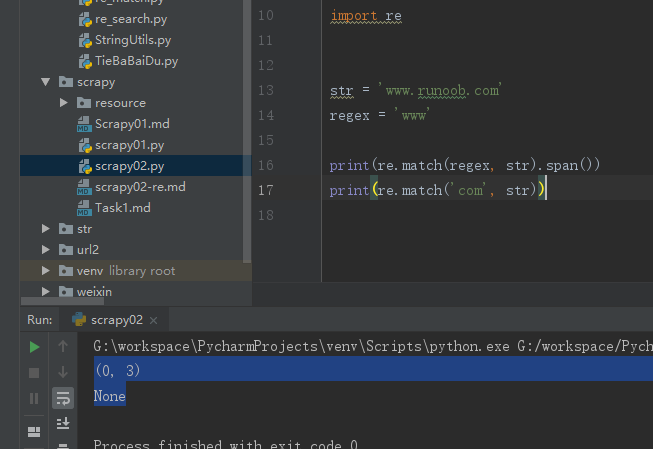
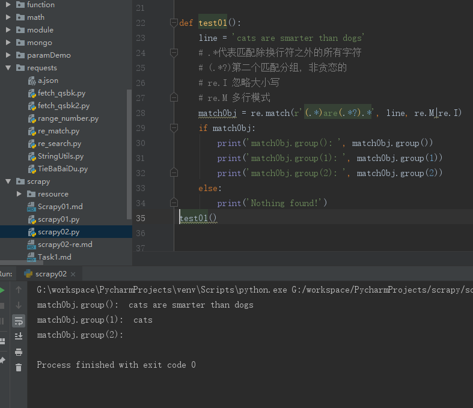
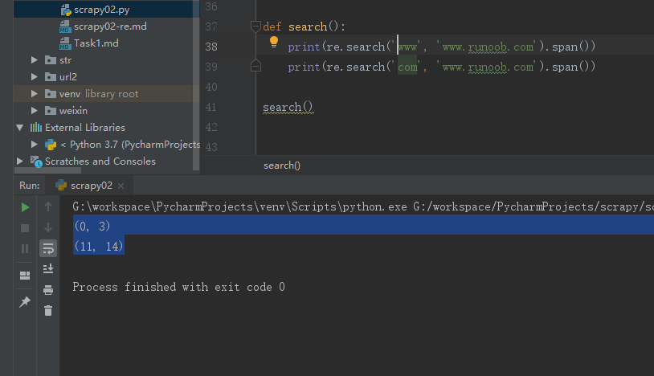
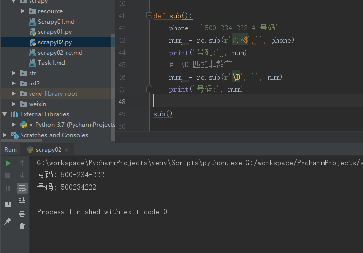
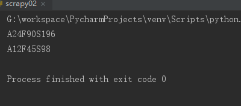
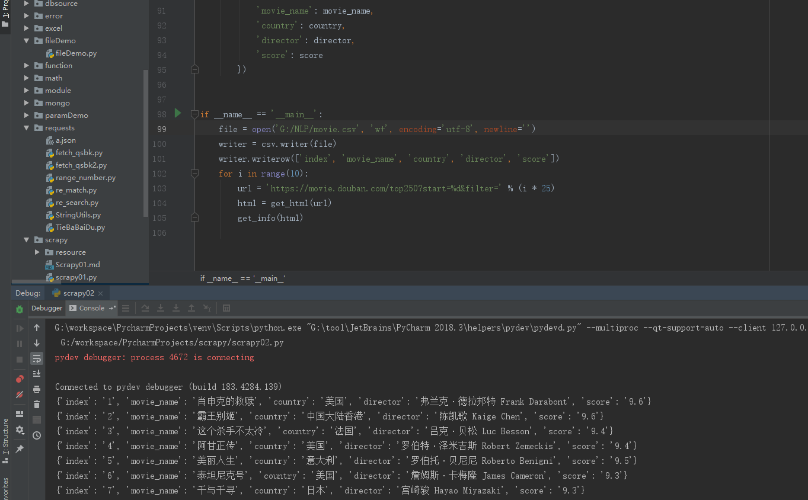

# python爬虫学习-day2正则表达式

>[python爬虫学习-day2正则表达式](https://desmonday.github.io/2019/03/02/python%E7%88%AC%E8%99%AB%E5%AD%A6%E4%B9%A0-day2%E6%AD%A3%E5%88%99%E8%A1%A8%E8%BE%BE%E5%BC%8F/)


正则表达式(Regular Expression)是一种文本模式，包括普通字符（例如，a到z之间的字母）和特殊字符（称为”元字符”）。正则表达式使用单个字符串来描述、匹配一系列匹配某个句法规则的字符串。


## 简介

我们很可能使用 ? 和 通配符来查找硬盘上的文件。? 通配符匹配文件名中的 0 个或 1 个字符，而 通配符*匹配零个或多个字符。

简单实例:
```bash
^[0-9]+abc$，其含义是：

^为匹配输入字符串的开始位置
[0-9]+匹配多个数字，[0-9]匹配单个数字，+匹配一个或者多个
abc$匹配字符abc并以abc结尾，$为匹配输入字符串的结束位置。
```

## 为什么使用正则表达式？

通过使用正则表达式，可以：

-   测试字符串内的模式。例如，可以测试输入字符串，以查看字符串内是否出现电话号码模式或信用卡号码模式。这称为数据验证。
-   替换文本。可以使用正则表达式来识别文档中的特定文本，完全删除该文本或者用其他文本替换它。
-   基于模式匹配从字符串中提取子字符串。可以查找文档内或输入域内特定的文本。

## python正则表达式

re模块使python语言拥有全部的正则表达式功能。


### re.match函数

re.match 尝试从字符串的起始位置匹配一个模式，如果不是起始位置匹配成功的话，match()就返回None。函数语法：
```
re.match(pattern, string, flags=0)。

    pattern: 匹配的正则表达式
    string: 要匹配的字符串
    flags: 标志位，用于控制正则表达式的匹配方式
```
我们可以使用group(num)或groups()匹配对象函数来获取匹配表达式。
```python
group(num=0): 匹配的整个表达式的字符串，
group() 可以一次输入多个组号，在这种情况下它将返回一个包含那些组所对应值的元组。
groups(): 返回一个包含所有小组字符串的元组，从 1 到 所含的小组号。
```

示例

```python


import re

def testMatch():
    str = 'www.runoob.com'
    regex = 'www'
    print(re.match(regex, str).span())
    print(re.match('com', str))
testMatch()
```

结果:    
    
 
span()函数span() 返回一个元组包含匹配 (开始,结束) 的位置。

```python
def test01():
    line = 'cats are smarter than dogs'
    # .*代表匹配除换行符之外的所有字符
    # (.*?)第二个匹配分组, 非贪恋的
    # re.I 忽略大小写
    # re.M 多行模式
    matchObj = re.match(r'(.*)are(.*?).*', line, re.M|re.I)
    if matchObj:
        print('matchObj.group(): ', matchObj.group())
        print('matchObj.group(1): ', matchObj.group(1))
        print('matchObj.group(2): ', matchObj.group(2))
    else:
        print('Nothing found!')
test01()
```

结果：    


### re.search函数
re.search 扫描整个字符串并返回第一个成功的匹配。函数语法：
```
re.search(pattern, string, flags=0)，参数含义与match函数的相同。
```

示例：

```python
def search():
    print(re.search('www', 'www.runoob.com').span())
    print(re.search('com', 'www.runoob.com').span())

search()
```


结果:



### re.match与re.search的区别
re.match只匹配字符串的开始，如果字符串开始不符合正则表达式，则匹配失败，函数返回None；
而re.search匹配整个字符串，直到找到一个匹配。


### 检索与替换
Python 的 re 模块提供了re.sub用于替换字符串中的匹配项。语法：
```
re.sub(pattern, repl, string, count=0, flags=0)。参数：

pattern : 正则中的模式字符串。
repl : 替换的字符串，也可为一个函数。
string : 要被查找替换的原始字符串。
count : 模式匹配后替换的最大次数，默认 0 表示替换所有的匹配。

```

示例：
```python
def sub():
    phone = '500-234-222 # 号码'
    num  = re.sub(r'#.*$','', phone)
    print('号码:' , num)
    #  \D 匹配非数字
    num  = re.sub(r'\D', '', num)
    print('号码:', num)
```

结果：   
 

repl参数一个函数

下面例子将字符串中的匹配的数字乘以2：
记住要加?号，否则没有命名成功为group:
```python
def double(matched):
    value = int(matched.group('value'))
    return str(value * 2)
def sub2():
    s = 'A12F45S98'
    # ?P<value> 代表为group分组，添加一个分组名
    print(re.sub('(?P<value>\d+)', double, s))
    # 记住要加?号
    print(re.sub('(P<value>\d+)', double, s))
sub2()

```


结果:




### re.compile函数

compile 函数用于编译正则表达式，生成一个正则表达式（ Pattern ）对象，供 match() 和 search() 这两个函数使用。
```
语法格式为：re.compile(pattern[, flags])

参数：

pattern : 一个字符串形式的正则表达式
flags : 可选，表示匹配模式，比如忽略大小写，多行模式等，具体参数为：
re.I 忽略大小写
re.L 表示特殊字符集 \w, \W, \b, \B, \s, \S 依赖于当前环境
re.M 多行模式
re.S 即为 . 并且包括换行符在内的任意字符（. 不包括换行符）
re.U 表示特殊字符集 \w, \W, \b, \B, \d, \D, \s, \S 依赖于 Unicode 字符属性数据库
re.X 为了增加可读性，忽略空格和 # 后面的注释
```

```python
import re

pattern = re.compile(r'world')
match = re.search(pattern, 'hello world')
# <re.Match object; span=(6, 11), match='world'>
## 可以匹配到，是匹配整个字符串
if match:
    print(match.group())
```


### re.findall函数

在字符串中找到正则表达式所匹配的所有子串，并返回一个列表，如果没有找到匹配的，则返回空列表。语法格式为：`findall(string, pos, endpos)`


```python
import re
a = re.findall(r"a(\d+?)", 'a23b')
print(a)
b = re.findall(r"a(\d+)", 'a23b')
print(b)
'''执行结果：
['2']
['23']'''

a = re.match('<(.*)>', '<H1>title<H1>').group()
print(a)
b = re.match('<(.*?)>', '<H1>title<H1>').group()
print(b)
'''执行结果：
<H1>title<H1>
<H1>'''

a = re.findall(r"a(\d+)b", 'a3333b')
print(a)
b = re.findall(r"a(\d+?)b", 'a3333b')
print(b)
'''
执行结果如下：
['3333']
['3333']
这里需要注意的是如果前后均有限定条件的时候，就不存在什么贪婪模式了，非匹配模式失效。
'''


```

## 爬取豆瓣top50的内容
结合requests、re两者的内容爬取 https://movie.douban.com/top250 中的内容，要求抓取名次、影片名称、国家、导演等字段。

示例：
```python
import re
import requests
import csv
# 结合requests、re两者的内容爬取 https://movie.douban.com/top250 中的内容，要求抓取名次、影片名称、国家、导演等字段。
def get_html(url):
    headers = {}
    headers[
        'User-Agent'] = 'Mozilla/5.0 (Windows NT 10.0; WOW64) AppleWebKit/537.36 (KHTML, like Gecko) Chrome/74.0.3729.108 Safari/537.36'
    res = requests.get(url, headers=headers)
    res.encoding = 'utf-8'
    if res.status_code == 200:
        return res.text
    return None

def get_info(html):
    pattern = re.compile(r'<li.*?<em class="">(.*?)</em>.*?<span class="title">(.*?)</span>.*?导演:(.*?)&nbsp;&nbsp;(.*?)<br>(.*?)&nbsp;/&nbsp;(.*?)&nbsp;/&nbsp;(.*?).*?</p>.*?<div class="star">.*?<span class="rating_num" property="v:average">(.*?)</span>.*?<span>(.*?)人.*?</li>', re.S)
    items = re.findall(pattern, html)
    for item in items:
        index = re.sub(re.compile('\s+'), '', item[0])
        movie_name = re.sub(re.compile('\s+'), '', item[1])
        country = re.sub(re.compile('\s+'), '', item[5])
        # director = re.sub(re.compile('\s+'), '', item[2])
        director = item[2].strip()
        score = re.sub(re.compile('\s+'), '', item[7])
        # 一个带有 yield 的函数就是一个 generator
        writer.writerow([item[0], item[1], item[5], item[2], item[7]])
        print({
            'index': index,
            'movie_name': movie_name,
            'country': country,
            'director': director,
            'score': score
        })


if __name__ == '__main__':
    file = open('G:/NLP/movie.csv', 'w+', encoding='utf-8', newline='')
    writer = csv.writer(file)
    writer.writerow(['index', 'movie_name', 'country', 'director', 'score'])
    for i in range(10):
        url = 'https://movie.douban.com/top250?start=%d&filter=' % (i * 25)
        html = get_html(url)
        get_info(html)

```


结果：

    


