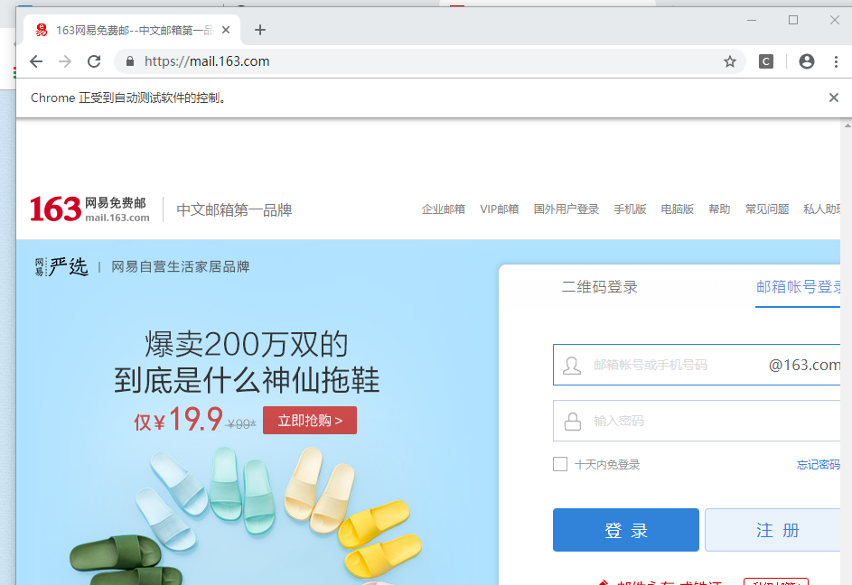
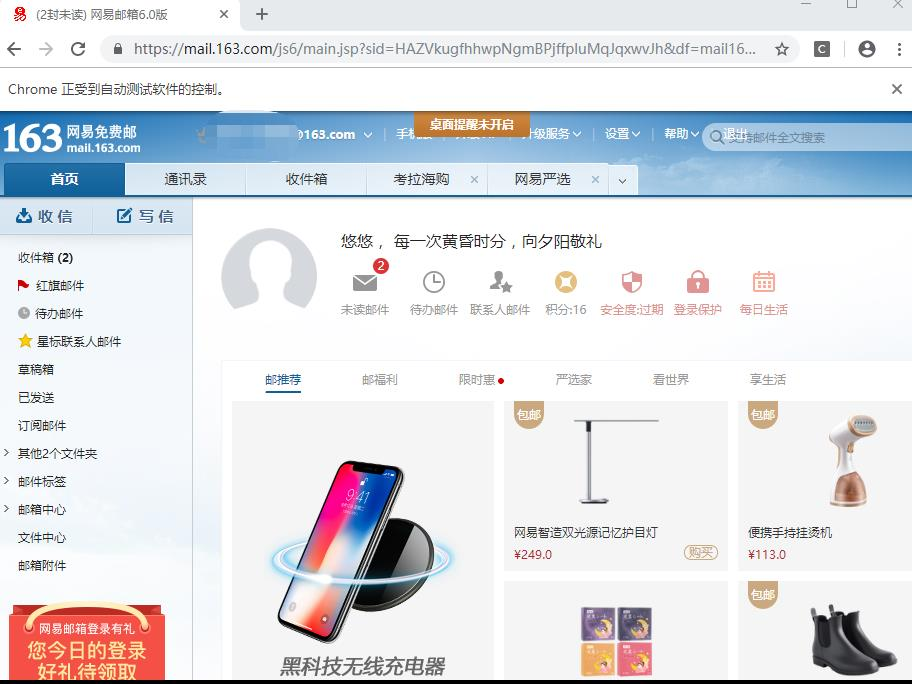

# 3.1 安装selenium并学习


## 1. 安装selenium并学习
学习系列：
-   [Selenium教程](https://selenium-python.readthedocs.io/)
-   [Python爬虫学习-Day5](https://blog.csdn.net/weixin_42937385/article/details/88150379)
-   [selenium的API](https://selenium-python-zh.readthedocs.io/en/latest/api.html)

## 2. 使用selenium模拟登陆163邮箱

## 3. 163邮箱直通点
https://mail.163.com/ 

## 4. 参考资料
https://blog.csdn.net/weixin_42937385/article/details/88150379

## 5. 问题
```
selenium.common.exceptions.WebDriverException: Message: 'chromedriver' executable needs to be in PATH.
```
解决
```
将chromdriver.exe放到py程序的当前目录下
```

代码：
```python
import time
from selenium import webdriver

browser = webdriver.Chrome()
url = 'http://mail.163.com'
browser.get(url)
time.sleep(3)

# open chrome tab
# browser.maximize_window()

time.sleep(5)
#找到邮箱账号登录框对应的iframe,由于网页中iframe的id是动态的，所以不能用id寻找
browser.switch_to.frame(0)
email = browser.find_element_by_name('email')
email.clear()
email.send_keys('username@163.com')
password = browser.find_element_by_name('password') 
password.clear()
password.send_keys('password')
login_em = browser.find_element_by_id('dologin')
login_em.click()
time.sleep(10)
```
结果：

